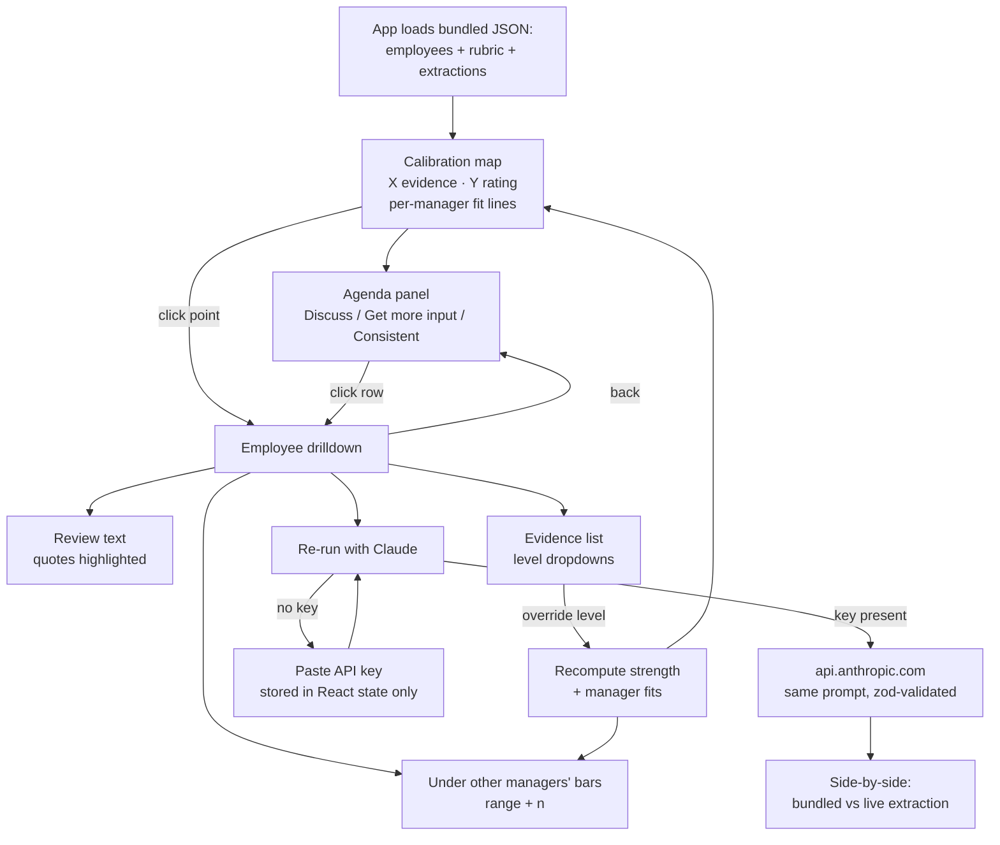

# UI design sketch

## Layout (wireframe)

```
┌──────────────────────────────────────────────────────────────────────────────┐
│ Calibration Map     "Is this rating a property of the evidence, or of    [🔑] │
│                      who wrote it?"                                          │
├───────────────────────────────────────┬──────────────────────────────────────┤
│                                       │ AGENDA            (default panel)    │
│  Rating                               │                                      │
│  4 ┤          ○     ●  ●     ●        │ ▸ Discuss (6)                        │
│    │        ●    ●╱  ●                │   ● Dana K.  Exceeds, evidence Meets │
│  3 ┤    ○  ●   ●╱● ●   ●              │   ● Omar S.  Meets, evidence Exceeds │
│    │      ● ●╱ ● ●                    │   ...                                │
│  2 ┤   ○ ●╱ ●  ●                      │ ▸ Get more input (5)                 │
│    │  ● ╱ ●                           │   ○ Lee P.   review too short to     │
│  1 ┤  ╱●                              │              judge                   │
│    └──┴────┴────┴────┴── Evidence     │   ...                                │
│       1    2    3    4                │ ▸ Looks consistent (19)              │
│                                       │                                      │
│  ● solid = enough evidence            │ Managers                             │
│  ○ hollow = low sufficiency           │  ── Priya   runs +0.8 above evidence │
│  ── per-manager fit (toggle in legend)│  ── Tom     runs −0.6 below          │
│  ╱  diagonal = rating matches evidence│  ── Ana     steeper bar for Exceeds  │
│                                       │  ── ...                              │
└───────────────────────────────────────┴──────────────────────────────────────┘

                       click a point → right panel becomes:

┌──────────────────────────────────────┐
│ ← back     Dana K. · L4 · mgr Priya  │
│ Rating: Exceeds (3)  Evidence: 2     │
│──────────────────────────────────────│
│ REVIEW                               │
│ "Dana [led the migration of the      │
│  billing service ...]  She is a      │
│  great communicator and [mentored    │
│  two new grads] ..."                 │
│   ▲ highlighted quotes, colour =     │
│     dimension; click → rationale     │
│──────────────────────────────────────│
│ EVIDENCE                             │
│  impact   above ▾  "led the migr..." │
│  collab   above ▾  "mentored two..." │
│  craft    at    ▾  "design doc mi..."│
│   ▲ dropdowns = facilitator override │
│     → strength recomputes, point     │
│       moves on map                   │
│──────────────────────────────────────│
│ UNDER OTHER MANAGERS' BARS           │
│  Priya (own)  Exceeds        n=5     │
│  Tom          Meets–Exceeds  n=5 ░░░ │
│  Ana          Meets          n=5 ░░  │
│  ...          (band width = n)       │
│──────────────────────────────────────│
│ [ Re-run with Claude ]  (needs key)  │
│  bundled ▸ strength 2   live ▸ 2     │
│  changed items marked                │
└──────────────────────────────────────┘
```

## Interaction flow


