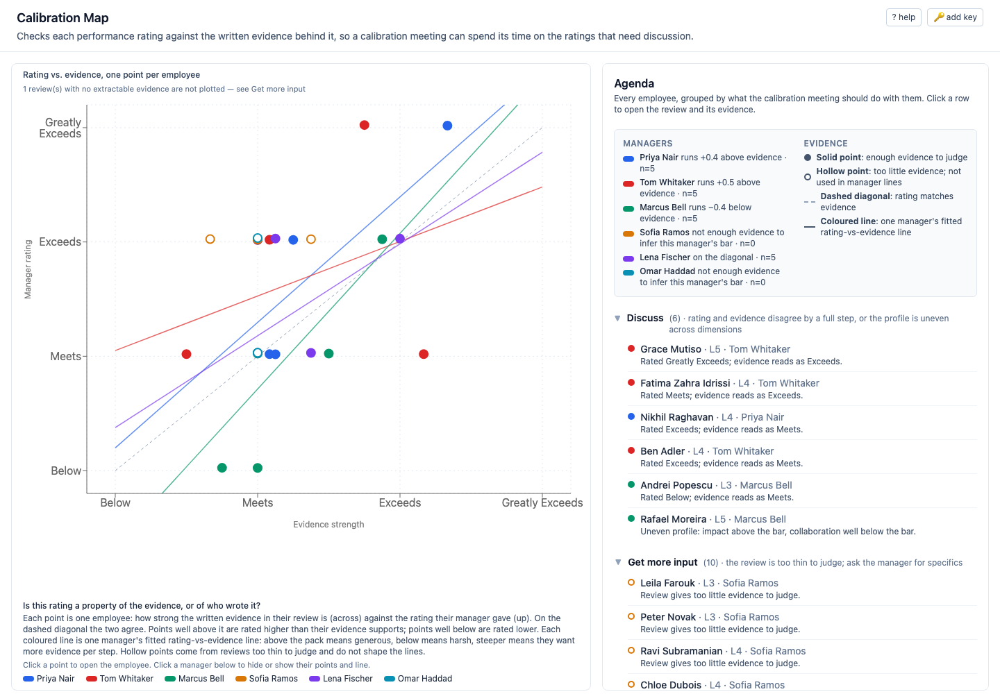

# Calibration Map

A tool for performance-review **calibration meetings**: the meeting where managers compare the ratings they gave their reports so that "Exceeds" means the same thing on every team. It answers one question for each rating: *is this rating supported by the evidence written in the review, or does it mostly reflect who wrote it?*

**Live demo:** <NETLIFY URL>

## What it does

1. **Claude reads every review as a rater.** For each employee it quotes the concrete evidence in the review (verbatim), tags each quote with a rubric dimension (Impact, Craft, Collaboration, Ownership), and grades it against the shared rubric for that employee's level: well below, below, at, above or well above the bar. It also says whether the review contains enough evidence to judge at all.
2. **Those grades become an evidence strength** on the same 1–4 scale as the ratings (Below, Meets, Exceeds, Greatly Exceeds), computed by a small client-side rule.
3. **The map plots evidence strength against the manager's rating**, one point per employee. Points on the diagonal are consistent; points far above it are rated higher than their evidence supports, far below is the reverse. A fitted line per manager shows whether that manager rates generously or harshly for the same evidence, and how much evidence they want before moving up a step. Reviews too thin to judge are drawn hollow and kept out of the lines.
4. **The agenda turns the map into a meeting plan.** *Discuss*: rating and evidence disagree by a full step, or the evidence is strong in one dimension and weak in another. *Get more input*: the review does not contain enough evidence, so the first ask is to the manager, not about the rating. *Looks consistent*: the rest.
5. **A drilldown lets the facilitator argue with the model.** It shows the review with the quoted evidence highlighted, the grade for each quote with the model's rationale, and a dropdown to override any grade. Overrides recompute the employee's point, the manager lines and the agenda instantly. It also shows where the same evidence would land under every other manager's line ("under other managers' bars"), with an uncertainty band.
6. **"Re-run with Claude"** sends the same prompt for one employee to the API live and shows the result side by side with the bundled one. It needs an Anthropic API key, kept in memory for the tab only.

The `? help` button in the app explains each panel in more detail.

## The data

Everything in the demo is synthetic and bundled, so it works with no key and no network:

- **6 managers × 5 reports = 30 employees**, one rubric with three levels (L3–L5). Each manager was written to a style: calibrated, lenient, harsh, verbose-but-vague, non-native English, terse. Four individual cases were planted: over-rated, under-rated, contradictory evidence, and a self-contradicting review. The styles and plants are recorded in `data/employees.json` and used only by the eval.
- **Precomputed extractions** for all 30 reviews, three runs each, in `data/extractions.json`. The app shows the canonical run.
- **An eval report** (`data/eval-report.md`) that treats the model as a rater to be checked: run-to-run stability (28/30 identical), quote fidelity (186/186 verbatim), agreement between the client-side strength rule and the model's own holistic score, and whether the planted manager styles and cases are recovered (10/10 checks pass).

## Run locally

Needs Node 22.

    npm install
    npm run dev      # http://localhost:5173
    npm test         # 58 unit tests: scoring, schema, prompt, state
    npm run build

An Anthropic API key is only needed for the optional "Re-run with Claude" button; it is held in React state and never written to storage.

## Regenerate the data

Two scripts rebuild the bundled data from the synthetic reviews. They are not needed to run the app.

    npm run extract   # reads data/employees.json + data/rubric.json; writes data/extractions.json
    npm run eval      # reads those; writes data/eval-report.md

`extract` runs the extraction prompt for every review three times (90 calls) and stores all runs, so the eval can measure stability. It calls Claude through **Claude Code headless mode** (`claude -p`) rather than the Anthropic SDK: I had no API key during the build, and an authenticated Claude Code CLI was the transport I did have. The prompt, the structured-output schema and the zod validation are shared with the in-browser re-run (`src/lib/prompt.ts`, `src/lib/schema.ts`); only the transport differs. Runs are concurrent across employees (4 at a time) and sequential within one, and take a few minutes.

`eval` needs no model access. It reads the stored runs and the planted ground truth and writes the report with pass/fail checks; the two design flaws it caught during the build, and the fixes, are described in `docs/RATIONALE.md`.

Because the browser path uses the SDK and I had no key, it was verified two ways short of a real call: with a mocked extractor for the success path (`VITE_MOCK_RERUN=1 npm run dev`) and against the real API with an invalid key for the 401 path. It was not run end to end with a valid key during development.

## Layout

- `src/components/` – the UI: map, agenda, drilldown, other-managers' bars, re-run, help and key dialogs
- `src/state/` – overrides reducer and the derived state (strengths, manager fits, agenda) recomputed on every override
- `src/lib/scoring.ts` – strength rule, manager fits (with shrinkage toward the pooled fit), implied-rating bands, agenda ranking
- `src/lib/prompt.ts`, `src/lib/schema.ts`, `src/lib/anthropic.ts` – the extraction prompt, output schema and SDK call, shared by the script and the browser
- `scripts/extract.ts`, `scripts/eval.ts` – precompute and evaluate the model-as-rater step
- `data/` – rubric, synthetic reviews with ground-truth tags, extractions, eval report
- `docs/RATIONALE.md` – why this problem, what is non-obvious, decisions, what the eval found, what was cut
- `docs/ui-design.md` – UI sketch and the design changes made after the first review
- `docs/TIMELOG.md` – time spent

## AI transcripts

The Claude Code session used to design and build this: <TRANSCRIPT LINK>
