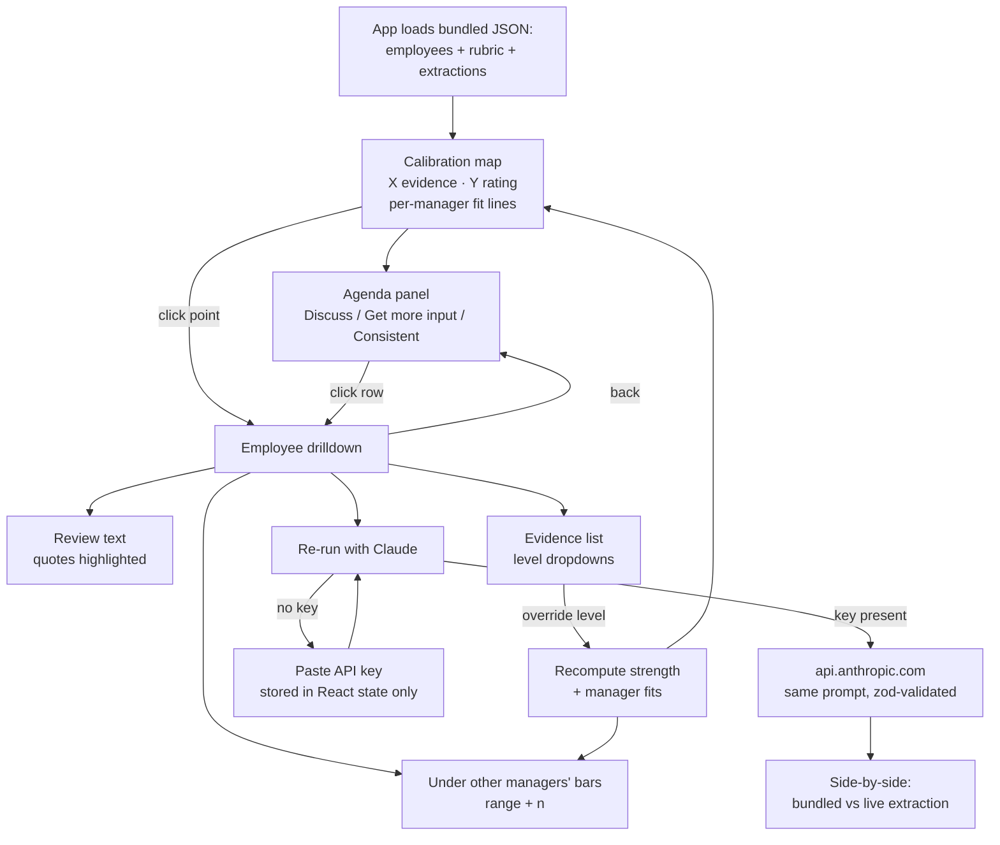

# UI design sketch

## Layout (wireframe)

```
┌──────────────────────────────────────────────────────────────────────────────┐
│ Calibration Map     "Is this rating a property of the evidence, or of    [🔑] │
│                      who wrote it?"                                          │
├───────────────────────────────────────┬──────────────────────────────────────┤
│                                       │ AGENDA            (default panel)    │
│  Rating                               │                                      │
│  4 ┤          ○     ●  ●     ●        │ ▸ Discuss (6)                        │
│    │        ●    ●╱  ●                │   ● Dana K.  Exceeds, evidence Meets │
│  3 ┤    ○  ●   ●╱● ●   ●              │   ● Omar S.  Meets, evidence Exceeds │
│    │      ● ●╱ ● ●                    │   ...                                │
│  2 ┤   ○ ●╱ ●  ●                      │ ▸ Get more input (5)                 │
│    │  ● ╱ ●                           │   ○ Lee P.   review too short to     │
│  1 ┤  ╱●                              │              judge                   │
│    └──┴────┴────┴────┴── Evidence     │   ...                                │
│       1    2    3    4                │ ▸ Looks consistent (19)              │
│                                       │                                      │
│  ● solid = enough evidence            │ Managers                             │
│  ○ hollow = low sufficiency           │  ── Priya   runs +0.8 above evidence │
│  ── per-manager fit (toggle in legend)│  ── Tom     runs −0.6 below          │
│  ╱  diagonal = rating matches evidence│  ── Ana     steeper bar for Exceeds  │
│                                       │  ── ...                              │
└───────────────────────────────────────┴──────────────────────────────────────┘

                       click a point → right panel becomes:

┌──────────────────────────────────────┐
│ ← back     Dana K. · L4 · mgr Priya  │
│ Rating: Exceeds (3)  Evidence: 2     │
│──────────────────────────────────────│
│ REVIEW                               │
│ "Dana [led the migration of the      │
│  billing service ...]  She is a      │
│  great communicator and [mentored    │
│  two new grads] ..."                 │
│   ▲ highlighted quotes, colour =     │
│     dimension; click → rationale     │
│──────────────────────────────────────│
│ EVIDENCE                             │
│  impact   above ▾  "led the migr..." │
│  collab   above ▾  "mentored two..." │
│  craft    at    ▾  "design doc mi..."│
│   ▲ dropdowns = facilitator override │
│     → strength recomputes, point     │
│       moves on map                   │
│──────────────────────────────────────│
│ UNDER OTHER MANAGERS' BARS           │
│  Priya (own)  Exceeds        n=5     │
│  Tom          Meets–Exceeds  n=5 ░░░ │
│  Ana          Meets          n=5 ░░  │
│  ...          (band width = n)       │
│──────────────────────────────────────│
│ [ Re-run with Claude ]  (needs key)  │
│  bundled ▸ strength 2   live ▸ 2     │
│  changed items marked                │
└──────────────────────────────────────┘
```

## Interaction flow



## Design updates after the first review (2026-09-14)

The first build put the tagline next to the page title, a one-line symbol key
above the chart, and the manager summaries at the bottom of the agenda. On a
first viewing it was hard to tell what the page was for. Changes made:

- **Header.** The title now has a one-sentence subtitle underneath it that
  says what the application does ("checks each performance rating against the
  written evidence behind it…"). The tagline ("Is this rating a property of the
  evidence, or of who wrote it?") moved under the chart, followed by a short
  paragraph on how to read the axes, the diagonal, the manager lines and hollow
  points. The chart header now carries only a plain caption and the override
  chip.
- **Help dialog.** A `? help` button sits in front of the key button and opens
  a modal that explains, section by section: the map, the agenda, the employee
  drilldown and overrides, "under other managers' bars", and re-running with
  Claude. Closes on Escape, backdrop click or the Close link.
- **Agenda header and legend.** The agenda pane now has a heading and a
  subtitle explaining what the groups are for. The manager legend moved from
  the bottom of the pane to the top, into a two-column block: managers
  (colour, name, one-line summary of their fitted line, n) on the left and a
  key to the map's marks (solid point, hollow point, dashed diagonal, coloured
  line) on the right. The chart keeps its own manager row underneath, because
  that row is the toggle.
- **Collapsible agenda groups.** Discuss, Get more input and Looks consistent
  are native `<details>` elements, so each expands and collapses independently
  with no state to manage and keyboard support for free. Discuss and Get more
  input start open; Looks consistent starts collapsed since it is the largest
  group and the least actionable.

Updated wireframe of the default panel:

```
┌──────────────────────────────────────────────────────────────────────────────┐
│ Calibration Map                                             [? help] [🔑 key] │
│ Checks each performance rating against the written evidence behind it, …     │
├───────────────────────────────────────┬──────────────────────────────────────┤
│ Rating vs. evidence, one point per    │ Agenda                               │
│ employee                 [n overrides]│ Every employee, grouped by what the  │
│                                       │ meeting should do with them…         │
│  (chart)                              │ ┌─ Managers ──────┬─ Evidence ─────┐ │
│                                       │ │ ── Priya  +0.4  │ ● enough       │ │
│                                       │ │ ── Tom    +0.5  │ ○ too little   │ │
│                                       │ │ ── …            │ ╱ diagonal     │ │
│                                       │ └─────────────────┴─ ── mgr line ──┘ │
│ Is this rating a property of the      │ ▼ Discuss (6) · …                    │
│ evidence, or of who wrote it?         │     rows…                            │
│ Each point is one employee: …         │ ▼ Get more input (10) · …            │
│ Click a point… Click a manager below… │     rows…                            │
│ ■ Priya ■ Tom ■ Marcus ■ …  (toggles) │ ▶ Looks consistent (14) · …          │
└───────────────────────────────────────┴──────────────────────────────────────┘
```
